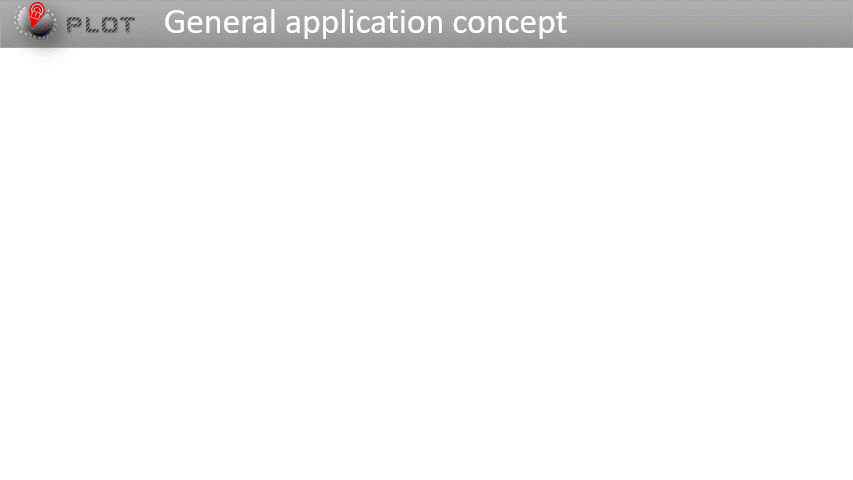
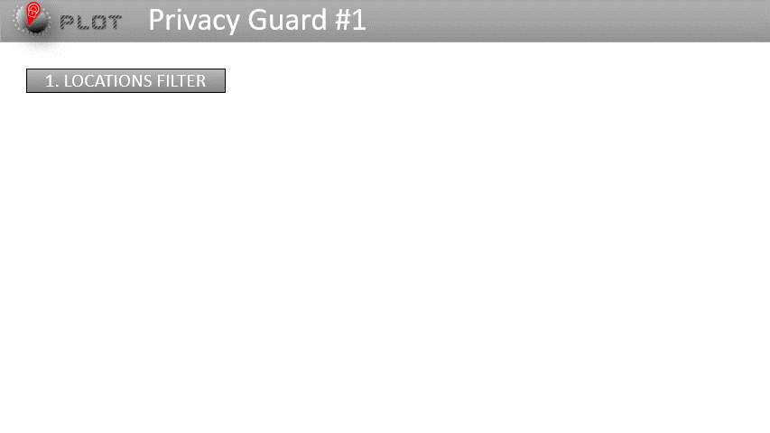
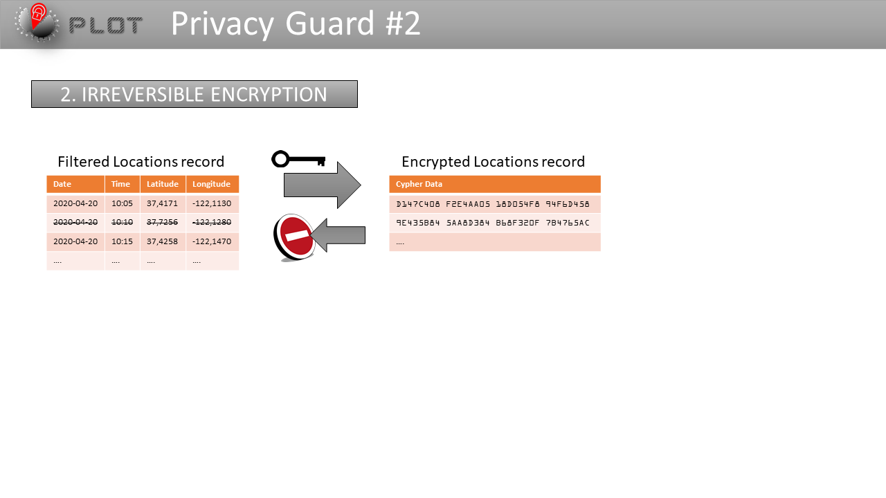
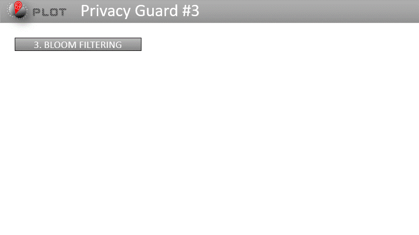
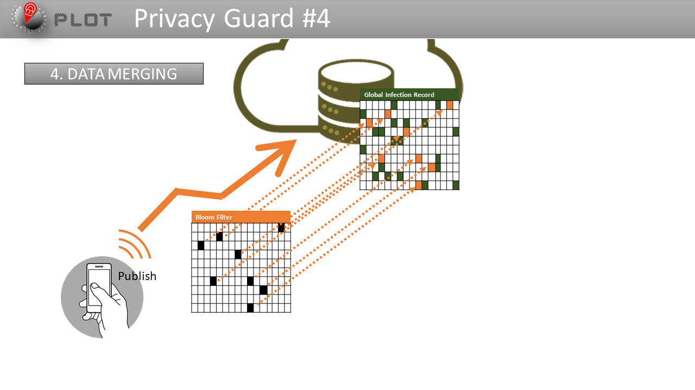
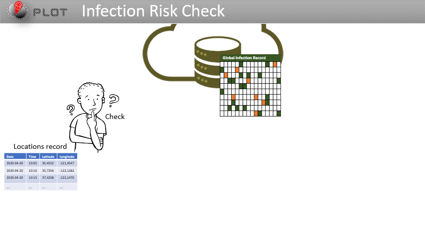
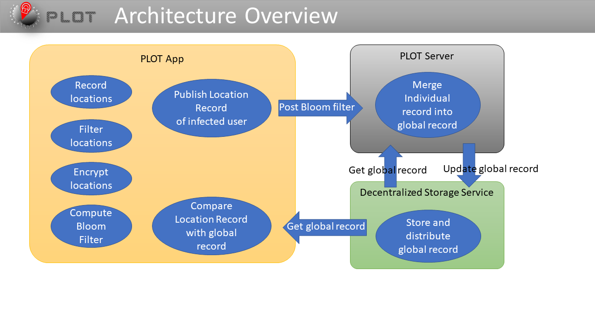

# PLOT
Associate Zero-Knowledge Proof mechanism to decentralized ledger to find how to preserve individual's privacy in location tracker applications

## Pitch

### Privacy Guards

### Check Usecase

### Architecture

### [Full Presentation Video](https://vimeo.com/415224700)

## Demos 🧏‍♂️

### [Location Filtering](https://vimeo.com/417369049)

### [Check Infection Status](https://vimeo.com/417369013)

### [Publish Personal Location Record](https://vimeo.com/417369083)

